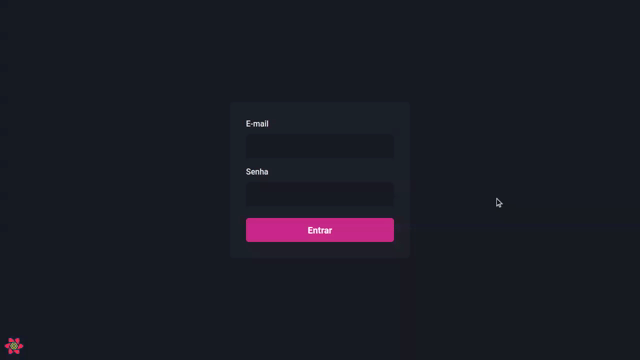

<h1 align="center">
    
</h1>

<p align="center">
  <a href="#desktop_computer-projeto"></a>&nbsp;
  <a href="#nail_care-layout"></a>&nbsp;
  <a href="#technologist-tecnologias"></a>
  <a href="#octocat-ambiente"></a>&nbsp;
  <a href="#bookmark_tabs-licença"></a>&nbsp;
</p>

<br>

<p align="center">
 
</p>

<br>
<hr>

## :desktop_computer: Projeto

<strong>dashgo</strong> é um aplicação feita para praticar conhecimentos em [Next.js](https://nextjs.org/).

Através da criação dessa aplicação foi possível aprender muitos conceitos, entre eles:

- Interface declarativa,
- React-Components,
- React-Props,
- React-Hooks,
- Integrações com API,
- Fake API,
- Gráficos,
- Axios.

Esta aplicação foi criada com o intuito de aprofundar conhecimentos em front-end no curso Ignite da [@Rocketseat](https://app.rocketseat.com.br/).

>`Alerta:` Por conta de alguns recursos na estilização não é recomendado utilizar IE 6-8 como browser ao utilizar essa aplicação.

## :nail_care: Layout
<p align="center">



</p>

<br>
<hr>

## :technologist: Tecnologias

- [Next.js](https://nextjs.org/)
- [React](https://pt-br.reactjs.org/)
- [Typescript](https://www.typescriptlang.org/)
- [Axios](https://github.com/axios/axios)
- [Apex Charts](https://apexcharts.com/docs/installation/#)
- [Chakra-UI](https://chakra-ui.com/)

<br>
<hr>

## :octocat: Ambiente

Para o correto funcionamento desta web aplicação tenha em mente que será necessário as seguintes instalações:

- [Git](https://git-scm.com/book/pt-br/v2/Come%C3%A7ando-Instalando-o-Git)
- [Yarn](https://classic.yarnpkg.com/en/docs/install/#debian-stable)

Siga as instruções para rodar a aplicação:

1. Clonar o repositório:

```bash
git@github.com:CaioLemec/ignews.git
```

2. No seu terminal instale as dependências usando:

```bash
 yarn
```

3. Para rodar a aplicação, use em seu terminal:

```bash
yarn dev  
```

4. Acesse o endereço em um browser compatível:

```bash
http://localhost:3000/
```

<br>
<hr>

## :bookmark_tabs: Licença

<br>

Projeto licenciado por MIT [LICENSE](./LICENSE.md).

<br>
<hr>
<br>

Fico à disposição para qualquer esclarecimento.


<h3>Caio Lemec<h3>
<a href="caiolemec@gmail.com">
<a href="https://br.linkedin.com/in/caio-lemec/">
<br>
</p>


